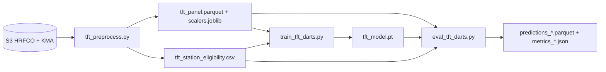

# TFT 평가 (validation / test)

학습(`src/train_tft_darts.py`) 이후 **val·test** 구간 성능을 측정하는 파이프라인.  
데이터·split 정책은 [`before_training.md`](before_training.md) 와 동일.

---

## 1. 파이프라인 개요



| 단계 | 스크립트 | 역할 |
|------|----------|------|
| 전처리 | `tft_preprocess.py` | 스켈레톤·merge·스케일·split |
| 학습 | `train_tft_darts.py` | train fit, val로 early stopping |
| **평가** | **`eval_tft_darts.py`** | val/test rolling forecast + 지표 |
| 매핑 검증 | `verify_tft_sample_mappings.py` | 상류 lag·AWS 강수 (학습 전) |

---

## 2. 데이터셋 정보

### 2.1 입력 파일 (`--processed-dir`)

| 파일 | 설명 |
|------|------|
| `tft_panel.parquet` | 관측소×1H 패널 (스케일된 `wl`, covariates, `split`) |
| `tft_{train,val,test}.parquet` | split별 부분집합 |
| `scalers.joblib` | 관측소별 `StandardScaler` (`{station_id}\|{col}` 키) |
| `preprocess_meta.json` | 기간·E/H·포함 관측소 수 |
| `tft_station_eligibility.csv` | `included_tft_train==Y` 학습·평가 대상 |

### 2.2 시간 split (고정)

| split | 시작 | 끝 |
|-------|------|-----|
| train | 2023-03-01 | 2024-08-31 |
| val | 2024-09-01 | 2025-03-31 |
| test | 2025-04-01 | 2025-10-31 |

### 2.3 평가에 쓰는 관측소

- **train에 포함된 관측소만** (`included_tft_train==Y`).
- val/test 평가 시에도 **동일 목록** 사용 (train에서 제외된 관측소는 점수 산출 안 함).

### 2.4 윈도

| 기호 | 기본값 | 의미 |
|------|--------|------|
| E | 168 | encoder 길이 (과거 168h) |
| H | 6 | 예측 horizon (1h·2h·3h·6h lead) |

평가 시 각 **origin 시각** `t₀` 에서:

- 입력: `datetime ≤ t₀` (train+val+test 중 해당 관측소 전체 이력)
- 예측: `t₀+1` … `t₀+H`
- 점수: **val** 또는 **test** 구간 안의 `t₀` 만 origin으로 사용

### 2.5 `dataset_summary.json`

`eval_tft_darts.py` 실행 시 평가 출력 폴더에 자동 생성.

- split별 행 수·관측소 수·`wl` 결측률
- eligibility 요약
- `preprocess_meta.json` 내용

---

## 3. 평가 방법 (rolling forecast)

1. 학습된 `TFTModel` 로드.
2. 관측소별로 eval 구간의 origin `t₀` 를 `--stride` 간격으로 순회 (기본 `stride=H`).
3. `model.predict(n=H, ...)` — **미래 강수·시간 피처**는 패널에서 `t₀+1…t₀+H` 사용.
4. 예측·실측을 `scalers.joblib` 로 **물리 수위(m)** 역변환.
5. lead별·관측소별 지표 집계.

**주의**

- 점수는 **스케일 전 공간(원 단위 수위)** 기준.
- test 평가는 **학습·val 완료 후 1회** 권장 (test 누수 방지).
- 샘플 패널처럼 val/test 행이 없으면 해당 split 평가 불가.

---

## 4. 성능 지표

모든 지표는 **역스케일된** `y_physical`, `yhat_physical` 기준.

| 지표 | 식 | 비고 |
|------|-----|------|
| **MAE** | `mean(|ŷ - y|)` | m |
| **RMSE** | `sqrt(mean((ŷ - y)²))` | m |
| **MAPE** | `mean(|ŷ - y| / max(|y|, ε)) × 100` | % |
| **NSE** | `1 - Σ(ŷ-y)² / Σ(y-ȳ)²` | 1에 가까울수록 좋음 |
| **bias** | `mean(ŷ - y)` | m, 양수=과대예측 |

**리드별**: `lead_h ∈ {1,2,3,6}` (기본 `--leads 1,2,3,6`) 각각 산출 + 전체 `all`.

---

## 5. 실행 예시

### 5.1 Validation (모델 선택·early stopping 확인)

```powershell
python -u src/eval_tft_darts.py `
  --split val `
  --experiment-name baseline_full_v1 `
  --processed-dir data/tft_processed `
  --eligibility-csv metadata_outputs/tft_station_eligibility.csv
```

### 5.2 Test (hold-out, 최종 보고)

```powershell
python -u src/eval_tft_darts.py `
  --split test `
  --experiment-name baseline_full_v1 `
  --processed-dir data/tft_processed
```

### 5.3 Val + test 한 번에

```powershell
python -u src/eval_tft_darts.py --split both --experiment-name baseline_full_v1
```

### 5.4 샘플 실험

```powershell
python -u src/eval_tft_darts.py `
  --split val `
  --experiment-name smoke_sample_v1 `
  --processed-dir data/tft_processed_sample_train `
  --eligibility-csv data/tft_processed_sample_train/tft_station_eligibility.csv `
  --max-series 5
```

---

## 6. `eval_tft_darts.py` 인자

| 인자 | 기본값 | 설명 |
|------|--------|------|
| `--split` | `val` | `val` / `test` / `both` |
| `--processed-dir` | `data/tft_processed` | 전처리 디렉터리 |
| `--eligibility-csv` | `metadata_outputs/tft_station_eligibility.csv` | 평가 관측소 필터 |
| `--work-dir` | `experiments/tft` | 실험 루트 |
| `--experiment-name` | *(필수)* | 학습 실험 이름 |
| `--model-path` | `{work-dir}/{name}/tft_model.pt` | 모델 경로 |
| `--stride` | `H` | rolling origin 간격(시간) |
| `--leads` | `1,2,3,6` | 리드별 지표 |
| `--max-series` | `None` | 디버그: 관측소 수 상한 |
| `--out-dir` | `experiments/tft/{name}/eval_{split}` | 출력 폴더 |

`--past-cov-cols`, `--future-cov-cols`, `--input-chunk-length`, `--output-chunk-length` 는 미지정 시 `train_args.json` 사용.

---

## 7. 출력 산출물

`experiments/tft/{experiment_name}/eval_val/` (또는 `eval_test`, `eval_both/val` …)

| 파일 | 내용 |
|------|------|
| `dataset_summary.json` | §2 데이터셋 요약 |
| `predictions_{split}.parquet` | origin·target 시각·lead·y·ŷ (스케일+물리) |
| `metrics_{split}.json` | 리드별·관측소별 집계 |
| `metrics_by_lead_{split}.csv` | 리드별 MAE/RMSE/NSE… |
| `metrics_by_station_{split}.csv` | 관측소×리드 |

`predictions_*.parquet` 주요 컬럼:

| 컬럼 | 설명 |
|------|------|
| `station_id` | 수위 관측소 |
| `origin_datetime` | 예측 시작 시각 t₀ |
| `target_datetime` | 실측/예측 대상 시각 |
| `lead_h` | 1…H |
| `y`, `yhat` | 스케일 공간 |
| `y_physical`, `yhat_physical` | 역스케일 수위(m) |

---

## 8. 실험 계획 연동

[`experiments/tft/tft_experiment_plan.json`](../experiments/tft/tft_experiment_plan.json) 의 P4(test eval) 단계에서 위 명령을 사용한다.

---

## 9. 관련 코드

| 모듈 | 역할 |
|------|------|
| `src/tft_eval_common.py` | 지표·역스케일·데이터셋 요약 |
| `src/eval_tft_darts.py` | CLI 평가 |
| `src/train_tft_darts.py` | 학습·`train_args.json` 저장 |
